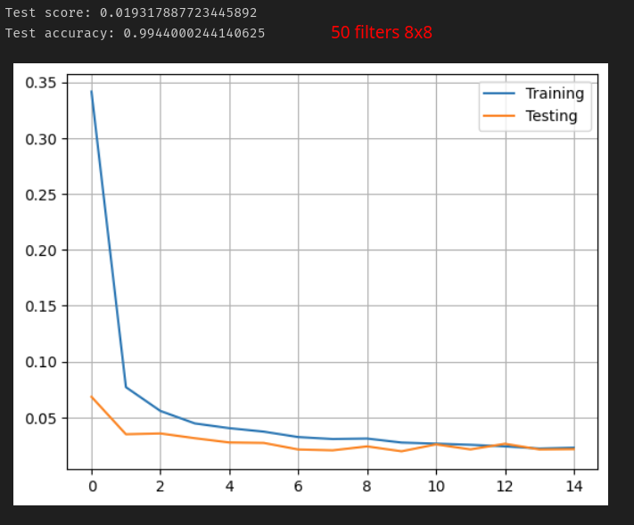
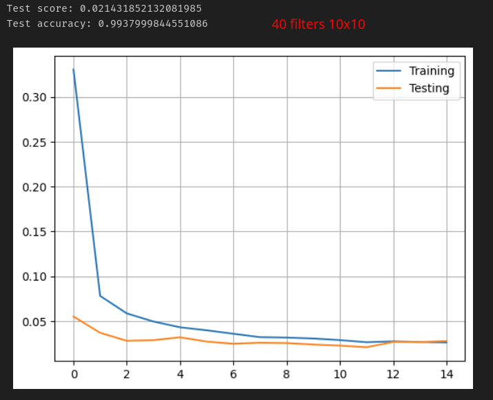
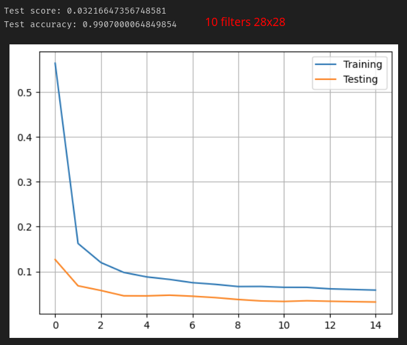
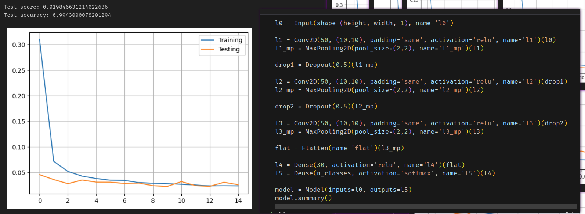

# Labo 3 - ARN
Auteurs: Felix Breval et Samuel Roland

## Introduction
TODO

<!-- What is the learning algorithm being used to optimize the weights of the neural networks? -->
<!-- What are the parameters (arguments) being used by that algorithm? -->
<!-- What loss function is being used ? -->
<!-- Please, give the equation(s) -->
<!-- For each experiment excepted the last one (shallow network learning from raw data, -->
<!-- shallow network learning from features and CNN): -->

<!-- 1. Select a neural network topology and describe the inputs, indicate how many are
they, and how many outputs? -->

<!-- 2. Compute the number of weights of each model (e.g., how many weights between the
input and the hidden layer, how many weights between each pair of layers, biases,
etc..) and explain how do you get to the total number of weights. -->

<!-- 3. Test at least three different meaningful cases (e.g., for the MLP exploiting raw data,
test different models varying the number of hidden neurons, for the feature-based
model, test pix_p_cell 4 and 7, and number of orientations or number of hidden
neurons, for the CNN, try different number of neurons in the feed-forward part)
describe the model and present the performance of the system (e.g., plot of the
evolution of the error, nal evaluation scores and confusion matrices). Comment the
differences in results. Are there particular digits that are frequently confused? -->

## Partie 4 - CNN sur digits
Après beaucoup de tests différents pour tenter de mieux comprendre l'impact de chaque type d'hyperparamètre, voici les essais pertinents et réflexions autour que nous avons pu faire. La plupart des tests ont tournés sur 15 ou 20 epochs, le but était d'avoir un nombre petit pour pouvoir faire plein de tests différents (entre 10s et 1 minute d'exécution avec une carte graphique correcte). En testant plus d'épochs sur une plus longue durée, on se rend compte que l'amélioration est possible mais bien faible et l'overfitting devient beaucoup plus compliqué à éviter (sans compter qu'il devient très lent de tester des changements de paramètres). Nous nous sommes rendus compte que les performances sont plus variables qu'un MLP, en relançant plusieurs fois la même configuration, il semble il y avoir beaucoup plus d'impact de l'aléatoire sur le résultat, changeant parfois 1-3% de différence d'accuracy finale, cela compliquait l'analyse de micro améliorations, était-ce de la chance ou cela allait-il vraiment dans la bonne direction ?

Au tout début, la configuration fournie donnait des résultats très très bizarre, une fois 31% d'accuracy, une autre fois 50%, puis 65%, en bref des valeurs qui changaient du tout au tout à chaque exécution. Cela était du au 2 neurones de la couche cachée du MLP de sortie, après recommendation du prof nous sommes partis sur 20 neurones, cette valeur a été changé un peu plus haut et plus bas mais cette valeur a l'air d'être effectivement la plus optimale. A ce moment, l'accuracy atteinte a été très vite sur ~60% et restait dans ces alentours.

Comme demandé, nous avons tenté de changer la taille des filtres, le nombre de filtres par couches, et d'ajouter plus ou moins de dropout. En poussant à beaucoup plus grand la taille des filtres et le nombre de filtres par couche, nous avons été étonnés de voir très vite monté l'accuracy de 88, puis 91, puis vers 96, 97, 98 et même 99% après beaucoup de tentatives. La seule chose que nous n'avons pas vraiment tenté de changer est la `pool_size=(2,2)` de `MaxPooling2D` comme cela n'était pas demandé et cela nous donnait des erreurs dû à des tailles incompatibles.

*Un exemple de résultat à 99%, le but étant de monté le dizième de pourcent au plus haut tout en gardant l'overfitting minimal. Ici, on voit qu'il y en a un peu.*

IL y avait également très souvent des configurations qui nous donnait une courbe d'entrainement significativement plus haute que celle d'entrainement, nous indiquant underfitting à cause que notre modèle n'apprend pas assez/qu'il est trop simple.

Pour faciliter la vie, nous avons gardé les mêmes configurations pour les 3 couches dans les essais suivants:

Nous avons d'abord bien poussé le nombre de filtres par couches, jusqu'à 50

Nous avons continué de monter (100 filtres) pour continuer sur ce gros gain de performance (90% -> 99%), mais l'overfitting nous rattrape...

Nous avons ensuite tenté de monter la taille des filtres, cela n'améliore que légèrement ici...

Ce qui est intéressant c'est de voir que dès qu'on rebaisse de 50 à 40 de nombre de filtres, la performance est un poil moins bonne et on voit tout de suite que la distance entre les 2 courbes se creusent à nouveau. Ce paramètre a l'air crucial pour que le modèle apprenne assez.

Même en augmentant la taille des filtres, on n'arrive pas à rejoindre les performances précédentes si le nombre de filtres est réduit.

Nous avons ensuite ajouté du dropout simple de 0.1 après la première couche de Conv2D + MaxPooling2D.

Puis avec 2 dropout intermédiaires

A un moment donné, la configuration suivante (3 fois 30 filtres de 10x10, max pooling de 2x2 toujours, avec 2 fois 0.5 de dropout intermédiaire) a donné une accuracy de **99.5%** ! C'était plus un coup de chance car la même configuration n'a jamais redonné ce même record pour ce labo.

<!-- The CNNs models are deeper (have more layers), do they have more weights than the
shallow ones? explain with one example. -->

<!-- TODO: pas sur de comprendre comment y répondre à ça -->

<!-- 4. Train a CNN for the chest x-ray pneumonia recognition. In order to do so, complete the
code to reproduce the architecture plotted in the notebook. Present the confusion matrix,
accuracy and F1-score of the validation and test datasets and discuss your results. -->